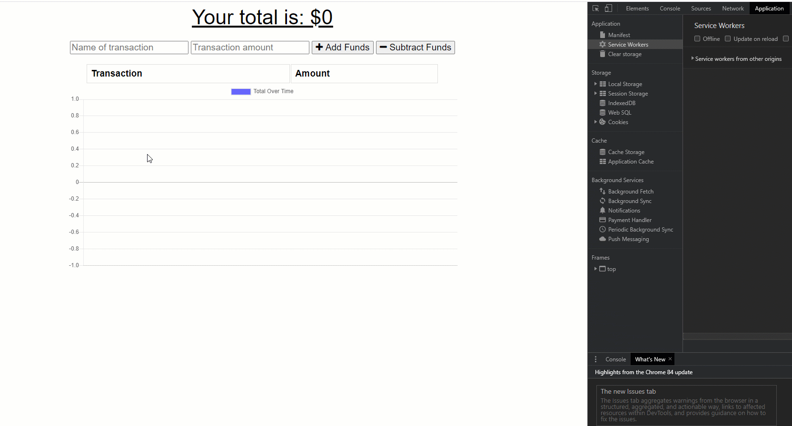

# Budget Tracker

https://shrouded-savannah-17670.herokuapp.com/

Track your Budget!

# Table Of Contents:

- [Heroku](#Heroku)
- [Description](#Description)
- [Installation](#Installation)
- [Usage](#Usage)
- [Technologies](#Technologies)
- [Contributors](#Contributors)

## GIF shot Budget Tracker!

# Description:

Track your budget, add or delete transactions from your budget!

# Installation:

The repository is set up , you will need to run npm init -y and npm install in order to install NPM packages .

Once the packages are installed you can start the server by typing node server file or by using nodemon.

The application can be run either on local port by accessing http://localhost:3000 which is connected to your local Mongo database or by running the app deployed in Heroku that is connected to a Mongo Database.

# Usage:

    1. Page loads you are prompted with current budget.
    2. You can either add or subtract to your budget, if you lose connection you can also add or subtract to it offline

# Technologies-

## Front-End Technologies:

    - HTML 5 is used to create a polished front-end.

    - Bootstrap: Which gives you a Modern front-end framework based on material design.

    - CSS : For styling the HTML pages.
    - Javascript: This application conforms to the ECMA script specification.

## Back-End Technologies:

    - Node.js: Javascript runtime environment that executes a Javascript code outside the web browser.
    - Express js : Designed for building web applications and API's
    - Express-session: Creates a session middleware and session data is stored on the server side.
    - Mongo DB

# Host:

    - Deployed in Heroku

# Installation:

    1. The repository is set up , you will need to run npm init -y and npm install in order to install NPM packages .

    2. npm install

    3. The application can be run either on local port by accessing http://localhost:300 which is connected to your local mongo database or by running the app deployed in Heroku that is connected to the mongo Database.

# Contributors:

    - Keith Beaudoin
